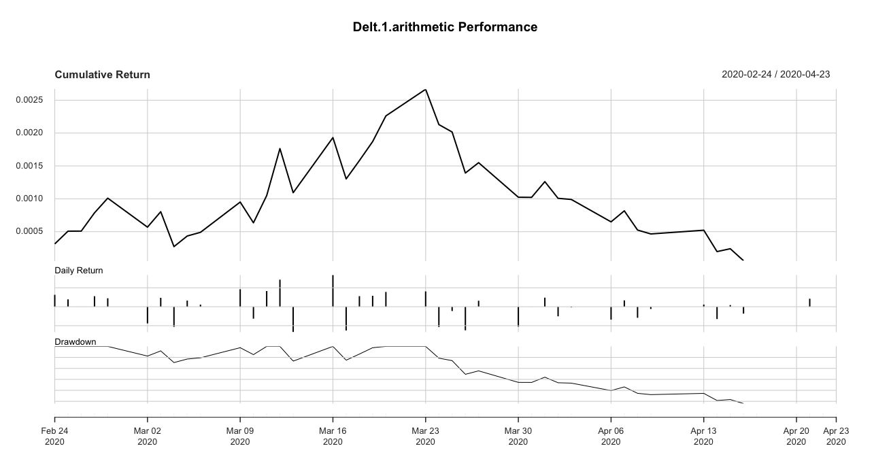

# Algorithmic Trading with Neural Networks

Given the coronavirus pandemic and the market volatily, there have been losses of billions of dollars worldwide. Where other services have come to a halt due to the imposed lockdowns, the pharmaceutical companies have gained traction in the race to develop the vaccine (and the cure as well) for the coronavirus. We attempt to model the reaction of the pharmaceutical firms to the coronavirus pandemic. Overall, we have a simple index holding strategy where we could theoretically invest in a portfolo rebalancing strategy for the DRG index. Such an exercise would however be out of scope for this project, and hence would be left for future discussions. 

### We do this with the following data:

### Index: DRG (NYSR ARCA DRG)
### Timeframe: '2020-01-01' to '2020-04-24'
### Comparison Index: DJI

```{r setup, include=FALSE}
knitr::opts_chunk$set(echo = TRUE)
```

First we load the necessary libraries for our computation.

```{r}
library(quantmod)
library(zoo)
library(stats)
library(tseries)
library(forecast)
library(fGarch)
library(rugarch)
library(nnet)
library(dplyr)
library(ggfortify)
library(magrittr) 
library(PerformanceAnalytics)
library()
```

We then import DRG index data from yahoo (please note that Yahoo has been inconsistent in providing appropriate data, hence Quandl or Tiingo would be much more viable for future computations). In addition, we import the DJI (Dow Jones Index) data to inspect the drawdown on the indices. 
 
```{r}
#DRG STANDS FOR NYSE ARCA PHARACEUTICAL INDEX
#Loading DRG data from Yahoo Finance
getSymbols("^DRG",src="yahoo", from = as.Date("2020-01-01"), to = as.Date("2020-04-25"),warnings=FALSE)
#Extracting DRG from Yahoo Finance - na.locf() can alter the matrix results
Pharma_Index<- (DRG[,"DRG.Close"])
head(Pharma_Index)
plot(Pharma_Index, col = "blue")
#SPY STANDS FOR NYSE ARCA PHARACEUTICAL INDEX
#Loading SPY data from Yahoo Finance
getSymbols("^DJI",src="yahoo", from = as.Date("2020-01-01"), to = as.Date("2020-04-24"),warnings=FALSE)
#Extracting DJI from Yahoo Finance - na.locf() can alter the matrix results
DJIndex<- (DJI[,"DJI.Close"])
head(DJIndex)

plot(DJIndex, col = "blue")
```

Above, we can visually compare the market drawdown on the DRG and the DJI (Down Jones Index). The difference in the market capitalization of the two index is not the concern of this exercise, rather it is the quick recovery from the pandemic drawdown. Which is obvious as the DJI is an industrial average index and the DRG is a dedicated index comprising of pharmaceutical companies. According to the NYSE, "The NYSE Arca Pharmaceutical Index (DRG) is designed to represent a cross section of widely held, highly capitalized companies involved in various phases of the development, production, and marketing of pharmaceuticals. This index contains stocks and ADRs of some of the most highly capitalized companies in the pharmaceutical industry". The reason for doing so is to observe whether the trained Artificial Neural Network (ANN) we create are able to gauge any market inconsistency and any possibility for future rise 

(NOTE: As of 2020-04-27, the DRG index has already recovered and is stable. This makes the exercise interesting as we can see whether the neural model can be trained to give accurate results for the given historical timeframe).  For the DRG data, we can see there is already a major recovery (given that pharmaceutical sector is essential right now).


##Calulating technical indicators

```{r}
#Implementing return
return <- Delt(Pharma_Index)
rows = nrow(return)
return <- return[2:rows]
plot(return, col = "grey")
#Implementing moving average
average10<- rollapply(Pharma_Index,10,mean) 
#plot(average10)
average20<- rollapply(Pharma_Index,20,mean) 
#plot(average20)
```

```{r}
#Implementing standard deviation
std10<- rollapply(Pharma_Index,10,sd) 
#plot(std10)
std20<- rollapply(Pharma_Index,20,sd)
#plot(std20)
```

```{r}
#Implement RSI
rsi5<- RSI(Pharma_Index,5,"SMA") 
#plot(rsi5)
rsi14<- RSI(Pharma_Index,14,"SMA")
#plot(rsi14)
```

```{r}
#Implement MACD
macd12269<- MACD(Pharma_Index,12,26,9,"SMA") 
#plot(macd12269)
macd7205<- MACD(Pharma_Index,7,20,5,"SMA")
#plot(macd7205)
```

```{r}
#Implement Bollinger Bands
bollinger_bands<- BBands(Pharma_Index,20,"SMA",2)
#plot(bollinger_bands)
```

Generate directions:
1. Return over the last 20 days > 2 % -> Up direction
2. Return over the last 20 days is between -2 % and 2 % -> Nowhere 
3. Return over the last 20 days < - 2 % -> Down direction

```{r}
#Generate a data frame named direction which consists of NA and a 
#number of rows the same as the number of rows in Pharma_Index and one column
direction<- data.frame(matrix(NA,dim(Pharma_Index)[1],1) )
#Calculate the return over the last 20 days (20 is not a fixed value 
#in quantitative finance. You can chose any value you consider)
lagreturn<- (Pharma_Index - Lag(Pharma_Index,20)) / Lag(Pharma_Index,20)
#Indicate Up, Down and Nowhere directions
direction[lagreturn> 0.02] <- "Up" 
direction[lagreturn< -0.02] <- "Down"
direction[lagreturn< 0.02 &lagreturn> - 0.02] <- "NoWhere"
```

We perform a preliminary Dickey-Fuller test for the stationarity of the returns.

```{r}
#_____________________________________________________________________________________________________________________________________________________________________________________________________________________________________________________________________________________________________________
# BEGIN DETERMINING PARAMETERS OF THE CHOSEN MODE (say GARCH)
#First we determine stationarity using the ADF test
adf.test(return)
```

We can see that our data is stationary. To determine the order of the model, let us plot the ACF and the PACF plots for the returns.

```{r}
pacf(return, lag.max = 150)
acf(return, lag.max = 100)
```

We use the `auto.arima` function to let the inbuild R package pick the appropriate model given the historical data.

```{r}
auto.arima(return)
```

Let us construct an ARIMA model with the based on the `auto.arima` determined values

```{r}

lengthOfReturns<-length(return)
timeseries <- ts(return)
ARIMA_Model <- arima(window(timeseries,1,lengthOfReturns), order=c(2,0,1), method = "ML")
summary(ARIMA_Model)
```
```{r}
acf((ARIMA_Model$residuals)^2)
pacf((ARIMA_Model$residuals)^2)
```
```{r}

model <- garchFit(formula = ~ arma(2,0) + garch(1,1) , data = timeseries, trace = F)
summary(model)
res = residuals(model)
qqnorm(res, col = "red")
```

```{r}
garch11_spec <- ugarchspec(variance.model = list(garchOrder = c(1, 1)),mean.model = list(armaOrder = c(2, 0)))
garch11_fit<-ugarchfit(spec=garch11_spec,solver.control = list(tol = 1e-12), data=timeseries)
garch11_fit
GFIT<- garch11_fit@fit$fitted.values
```

```{r}
plot(timeseries, type="l", col="blue") + lines(garch11_fit@fit$fitted.values, col="green")
```


```{r}
#binding closing price and technical analysis indicators into a variable Pharma_Index_Bind

Pharma_Index_Bind <- cbind(Pharma_Index[2:nrow(Pharma_Index)], average10[2:nrow(average10)], average20[2:nrow(average20)], std10[2:nrow(std10)], std20[2:nrow(std20)], rsi5[2:nrow(rsi5)], rsi14[2:nrow(rsi14)], macd12269[2:nrow(macd12269)], macd7205[2:nrow(macd7205)], bollinger_bands[2:nrow(bollinger_bands)])

#integrate GARCH model rolling window prediction output into variable 
Pharma_Index_model <- cbind(Pharma_Index_Bind,garch11_fit@fit$fitted.values)
```

## Including Google trends data into the GARCH model

From the article “Quantifying Trading Behavior in Financial Markets Using Google Trends” it is showed that we can trade efficiently if we take into consideration the frequency of certain key words in Google searches. *[T. Preis, H. S. Moat & H.E. Stanley. (2013)]*

Inline with our topic of interest, we download google trends data regarding the term "Coronavirus". The timeframe of this data will be the same as our pharamceutical index data. We bind this trends data with our above `Pharma_Index_Model` and analyze further.

```{r}
#_____________________________________________________________________________________________________________________________________________________________________________________________________________________________________________________________________________________________________________
#ADD GOOGLE TREND DATA HERE AND INTEGRATE INTO Pharma_Index using cbind
#Creating Pharma_Index dataset using cbind function
#Closing price and indicators are put into one variable called Pharma_Index
#For adjusting the trend dates with those of the Market trading dates, we extracted the Dates from column 0 of Pharma_index_model
#write.csv(as.data.frame(DATAFRAMENAME[,1]), "PATHNAME\\Filename.csv", row.names = TRUE)

coronavirus_trend <- read.csv("Coronavirus.csv", header=F)$V2
#Bind with Pharma_Index_Model
Pharma_Index_coronavirus <- na.locf(cbind(Pharma_Index_model$DRG.Close ,coronavirus_trend))
```

Dividing neural network dataset in three parts:
1. Training dataset -> training the neural network
2. Validating dataset -> validating the estimated parameters
3. Testing dataset -> measure the accuracy of the prediction

The choice of timeperiods is crucial here as we would like the see the drawdown impact of the coronavirus pandemic and whether the model can forecast any reasonable scenario. Given the coronavirus trends data, we know that the first instance of coronavirus Google searches were at the start of the january 2020. So our timeframe should be from `2020-01-01` to `2020-04-14`

```{r}
#Indicate end and start dates for train, validating and testing period
train_sdate<- "2020-01-03"
train_edate<- "2020-04-23" 
vali_sdate<- "2020-01-03" 
vali_edate<- "2020-04-23" 
test_sdate<- "2020-01-03" 
test_edate<- "2020-04-23"
```

## Constructing date ranges for the three datasets

```{r}
#Generate row numbers where the date is greater than and equal to 
#start date and less than equal to the end date. Which() function is used
trainrow<- which(index(Pharma_Index) >= train_sdate& index(Pharma_Index) <= train_edate)
valirow<- which(index(Pharma_Index) >= vali_sdate& index(Pharma_Index) <= vali_edate)
testrow<- which(index(Pharma_Index) >= test_sdate& index(Pharma_Index) <= test_edate)
```

## Extract data for training, validating and testing periods

```{r}
#Extracting data for training, validating and testing periods
trainDRG<- Pharma_Index[trainrow,] 
valiDRG<- Pharma_Index[valirow,] 
testDRG<- Pharma_Index[testrow,]
```
```{r}
#Calculate mean and standard deviation of the training data
trainme<- apply(trainDRG,2,mean) 
trainstd<- apply(trainDRG,2,sd)
```
```{r}
#Create three matrices of dimensions equal to the Training, validating and testing data dimensions
trainidn<- (matrix(1,dim(trainDRG)[1],dim(trainDRG)[ 2]))
valiidn<- (matrix(1,dim(valiDRG)[1],dim(valiDRG)[2] ))
testidn<- (matrix(1,dim(testDRG)[1],dim(testDRG)[2] ))
```
```{r}
#Normalize the three datasets.
#T() function is used for matrix transposing.
norm_trainDRG<- (trainDRG - t(trainme*t(trainidn))) /t(trainstd*t(trainidn))
norm_valiDRG<- (valiDRG - t(trainme*t(valiidn))) / t(trainstd*t(valiidn))
norm_testDRG<- (testDRG - t(trainme*t(testidn))) / t(trainstd*t(testidn))
```
```{r}
#Define training, validating and testing period
traindir<- direction[trainrow,1] 
validir<- direction[valirow,1] 
testdir<- direction[testrow,1]
```

## Implement the Artificial Neural Network

```{r}
library(nnet)
```

```{r}
#Implement ANN
#The neural network starts with random weights and will provide different results. 
#Seed() function will allow the same output every time
set.seed(1)
```
```{r}
#Implement ANN
#Parameter 1 -> All normalized columns
#Parameter 2 -> Target vector
#Parameter 3 -> number of hidden layers (4 in this case)
#Parameter 4 -> Output is indicated at the end (trace=T) or not (trace=F)
neural_network<- nnet(norm_trainDRG,class.ind(traindir),size=4,trace=T)
neural_network
```

```{r}
#Obtain data dimension
dim(norm_trainDRG)
#Make predictions
vali_pred<- predict(neural_network,norm_valiDRG)
head(vali_pred)
```

```{r}
#Calculate the predicted direction using the information obtained above.
vali_pred_class<- data.frame(matrix(NA,dim(vali_pred)[1],1))

#The next lines are used for checking the condition.
vali_pred_class[vali_pred[,"Down"] > 0.5,1] <- "Down"
vali_pred_class[vali_pred[,"NoWhere"] > 0.5,1] <- "NoWhere"
vali_pred_class[vali_pred[,"Up"] > 0.5,1] <- "Up"
```

```{r}
#Check forecasts accuracy
#Load caret library
#Use confusionMatrix() over the predicted class and original class for the validating dataset.
library(caret)
u<- union(vali_pred_class[,1],validir)
t<-table(factor(vali_pred_class[,1],u),factor(validir,u))
confusionMatrix(t)
```

```{r}
#Check the accuracy on testing data
test_pred <- predict(neural_network,norm_testDRG)
head(test_pred)
```

```{r}
#Indicate the classes for the testing data
test_pred_class<- data.frame(matrix(NA,dim(test_pred)[1],1) )
test_pred_class[test_pred[,"Down"] > 0.5,1] <- "Down"
test_pred_class[test_pred[,"NoWhere"] > 0.5,1] <- "NoWhere"
test_pred_class[test_pred[,"Up"] > 0.5,1] <- "Up"
#Check the accuracy of the forecasts
u<- union(test_pred_class[,1],testdir)
t<-table(factor(test_pred_class[,1],u),factor(testdir,u))
confusionMatrix(t)
```

```{r}
#Generate trade signals 
signal<- ifelse(test_pred_class =="Up",0.01,ifelse(test_pred_class =="Down",-0.01,0)) 
head(signal)
```

```{r}
test_return_DRG<- return[(index(return)>= test_sdate & index(return)<= test_edate), ]
test_return<- test_return_DRG*(signal)

#calculate cummulative return
cumm_return<- Return.cumulative(test_return)
cumm_return
```
```{r}
#calculate annual return
annual_return<- Return.annualized(test_return)
annual_return
```
```{r echo=FALSE, out.width='100%'}
#charts.PerformanceSummary(test_return)# - we run this but use the output image 
#save output in .png format and add there 

```
```{r}
VaR(test_return, p=0.95)
SharpeRatio(as.ts(test_return), Rf = 0, p=0.95, FUN = "StdDev")
SharpeRatio.annualized(test_return, Rf=0)
```

## Compiled Results

The above neural network trained on the DRG - DJI and coronavirus Google trends data, provides the following output.

1. `a 1-4-3 network with 23 weights`
`options were -`

2. `The first layer (input layer) -> 1`
   `The second layer (hidden layer) -> 4`
   `Third layer (output layer) -> 3`
   `Weighted parameters -> 23`

3.  `Dim(norm_traindji)` function provides the following output
     [1] 71  1
    
4. Number of columns = number of neurons in the input layer = number of input data features = 1

## Conclusion

The project demonstrated a simple artificial neural network which trains data and tests it, making the stock data to combine with trend data. There are however more efficient methods available in R. Such neural networks can be made to use the machine GPU (Graphics Processing Unit) along with the CPU, and produce deep learning results. Popular programs with deeplearning libraries which can be installed in R are Tensorflow, Keras, and Pytorch.


# References
- The NYSE Arca Pharmaceutical Index (DRG), NYSE. <https://www.nyse.com/publicdocs/nyse/indices/nyse_arca_pharmaceutical_index.pdf>
- Preis T., Moat H., Stanley E. Quantifying Trading Behavior in Financial Markets Using Google Trends, Scientific Reports. (2013).  <https://www.nature.com/articles/srep01684>
- DeGroot M., Schervish M. Probability and Statistics, Fourth Edition (2014)
